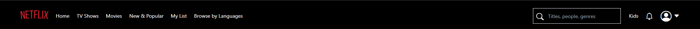
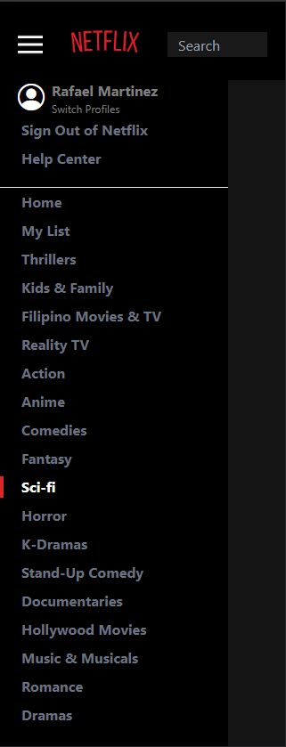

# Netflix-Clone
  This mini project uses Tailwind CSS, React JS and TypeScript using Vite as a build tool. It is a Netflix clone with a few features. It is a work in progress and I will be adding more features to it.

## Goal
    The goal of this project is to learn how to use Tailwind CSS, React JS and TypeScript together. I will be adding more features to it as I learn more about these technologies.

## Features
      - [x] Home Page
      - [x] Navbar
      - [x] Row
  
## Technologies Used
      - [x] Tailwind CSS
      - [x] React JS
      - [x] TypeScript
      - [x] Vite

## How to run the project
      - Clone the project
      - Run `npm install`
      - Run `npm run dev`
      - Open `http://localhost:3000` in your browser

## Desktop View

## Mobile View

By: raf.dev